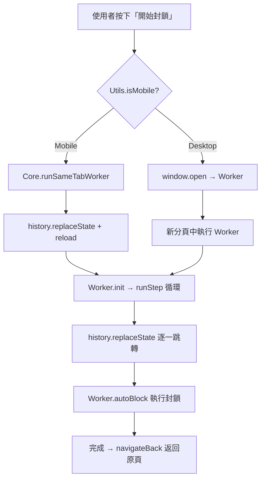

# 🛡️ 封鎖機制架構文件 (Blocking Architecture)

> **⚠️ 重要：任何涉及封鎖流程的修改前，必須先閱讀此文件。**
> 本文件記錄了所有封鎖路徑、平台差異、以及已知的 iOS 安全限制與對應解法。

---

## 平台偵測

```
Utils.isMobile() → true:  iOS / iPadOS (包含偽裝為 MacIntel 的 iPad)
Utils.isMobile() → false: Desktop (Mac/Windows/Linux)
```

偵測邏輯位於 `src/utils.js`，iPad 透過 `navigator.platform === 'MacIntel' && navigator.maxTouchPoints > 1` 判定。

---

## 兩種封鎖路徑總覽



---

## 路徑 1：Mobile 同分頁 Worker (`runSameTabWorker`)

**檔案**：`core.js` → `worker.js`
**適用**：iOS / iPadOS
**入口**：`main.js:handleMainButton` → `Core.runSameTabWorker()`

### 流程

1. 將 `pendingUsers` 合併至 `BG_QUEUE` (localStorage)
2. 儲存 `hege_return_url` = 當前頁面 URL（去除 `hege_bg` 參數）
3. **`history.replaceState`** 修改 URL 為 `/?hege_bg=true`
4. **`location.reload()`** 重新載入頁面
5. 頁面載入後，`main.js` 偵測 `hege_bg=true` → 呼叫 `Worker.init()`
6. Worker 顯示全螢幕進度 UI（進度條、ETA、統計、停止按鈕）
7. `Worker.runStep()` 逐一處理佇列：
   - 以 **`history.replaceState`** + `reload` 跳轉到 `/@username?hege_bg=true`
   - 執行 `Worker.autoBlock()` 自動化封鎖流程
8. 佇列清空後，`Worker.navigateBack()` 以 **`history.replaceState`** + `reload` 返回原頁

### ⛔ iOS 安全限制（絕對不能違反）

| 禁止行為 | 原因 |
|---|---|
| `window.location.href = 'threads.net/...'` | 觸發 **Universal Links**，開啟原生 Threads App |
| `window.open(...)` | 被 Safari **彈出視窗阻擋器**攔截 |
| `<iframe src="threads.net">` | UserScript **不會注入** iframe |
| click handler 內直接 `location.href` | 即使 setTimeout(0) 也可能觸發 Universal Links |

### ✅ 唯一安全的導航方式

```javascript
history.replaceState(null, '', newPath);
location.reload();
```

這不是「導航到新頁面」，而是「修改當前 URL + 重新整理」，Safari 不會觸發 Universal Links。

---

## 路徑 2：Desktop 背景分頁 Worker (`window.open`)

**檔案**：`main.js` → `worker.js`
**適用**：Desktop（Mac / Windows / Linux）

### 流程

1. 將 `pendingUsers` 合併至 `BG_QUEUE`
2. `window.open(<current-origin>/?hege_bg=true, ...)` 開啟同網域新分頁
3. 新分頁載入 → `Worker.init()` → `Worker.runStep()` 循環
4. Worker 顯示進度 UI（與 Mobile 相同的進度條、ETA、統計、停止按鈕）
5. Worker 以同網域路徑逐一跳轉（Desktop 不受 Universal Links 影響）
6. 完成後 `window.close()` 關閉分頁

### 跨分頁通訊

- Worker 必須與主分頁維持同一個 origin，避免 `threads.com` / `threads.net` 的 localStorage 設定與 queue 分裂
- Worker 透過 `localStorage` (BG_STATUS, BG_QUEUE, FAILED_QUEUE) 與主分頁同步狀態
- 主分頁透過 `window.addEventListener('storage', ...)` + `setInterval` 輪詢更新 UI
- 監聯的 key 包含：`BG_STATUS`, `DB_KEY`, `BG_QUEUE`, `COOLDOWN`, `COOLDOWN_QUEUE`, `FAILED_QUEUE`

---

## Chrome-only 手動三無追蹤者掃描

**檔案**：`main.js` → `features/three-no-watch.js`
**適用**：Chrome Extension
**不適用**：Userscript / Safari / Firefox

### 流程

1. 使用者在 floating menu 點選「掃描三無追蹤者」後，`Core.ThreeNoWatch.startManualScan()` 檢查掃描鎖與背景 worker 是否忙碌。
2. 若符合條件，content script 直接用 `window.open(...hege_bg=true&hege_three_no_scan=true...)` 開啟 Threads worker 分頁；在其他人的 profile 頁可使用「掃描此帳號粉絲三無」，此時 `hege_three_no_target_owner` 會指定掃描對象。
3. worker 分頁先 bootstrap 自己的 Threads username，再進入自己的 profile，開啟粉絲 dialog 並以 `CONFIG.THREE_NO_SCAN_BATCH_SIZE` 位粉絲為單位自動續掃；已掃過帳號記錄在本機 cursor，同一個 worker 會持續往下收集，直到備選名單超過使用者設定的 `hege_three_no_candidate_threshold`（預設 `CONFIG.THREE_NO_SCAN_CANDIDATE_REPORT_THRESHOLD`）、掃到底，或遇到無法再前進的防呆狀態才產出報告。
4. 粉絲列表會先做候選預篩：列表無可見頭像者優先進 profile 檢查；Threads / Instagram 匿名預設頭像（例如 `anonymous_profile_pic` / `ig_cache_key=YW5vbnltb3VzX3Byb2ZpbGVfcGlj` / static CDN fallback `5OTfmveiK1K.jpg`）必須視為無頭像；列表已有非預設可見頭像但 username 符合「動物字詞 + 數字亂碼」/ `a09xxxxxxxx` 台灣手機格式者，也會作為次要候選進 profile 檢查；列表已有非預設可見頭像且 username 正常者會寫入本批 cursor 但不進 profile。
5. worker 進入 profile 後保守判斷：必須無大頭照，且同時符合「無自我介紹 / 無發文 / 無回文 / 無轉貼 / 命名可疑」任一項，才列入三無管理清單。worker 也會嘗試讀取「關於此個人檔案」中的加入時間與所在地點，供本機標籤與 filter 使用。
6. 結果寫入同 origin `localStorage`，主分頁透過 storage sync / polling 更新 floating icon 與 menu，並在新的掃描結果完成時自動彈出報告；自動彈報告只允許出現在啟動掃描的原本 tab（以 `sessionStorage` / `window.name` 的 scan anchor 判定），避免使用者從報告點開帳號檢查時，新開 profile tab 又重複跳出報告；worker 會先自動續掃到備選門檻或掃到底，不會每一小批都要求使用者按「續掃下一批」。完成結果會以 username 合併到既有本機三無管理清單，不因下一次掃描覆蓋舊資料。
7. 管理視窗讓使用者自行決定後續處理：可用多重 filter 依三無原因、加入時間、國家/地區、掃描來源與掃描日期縮小清單，再勾選加入清理名單、忽略或直接封鎖。若使用者在設定中開啟 `hege_three_no_auto_block`，掃描完成後會直接把本批新三無名單加入既有 `BG_QUEUE`，設定 `WORKER_MODE=block`，並讓同一個 worker 分頁轉入一般封鎖 worker；此路徑不新增 Chrome 權限。
8. 掃描完成後，worker 分頁嘗試上傳匿名 aggregate 統計，寫入報告狀態，然後呼叫 `window.close()` 關閉自己。

### 權限邊界

- 三無掃描不使用 MV3 background service worker；必須由使用者點擊觸發 `window.open`，與一般 Desktop 背景分頁 Worker 模型一致。
- 不使用 `chrome.scripting` 動態注入。
- 不要求 `tabs` permission；不讀取 tab URL / title / favicon 等敏感欄位。
- 三無名單與標籤只留在本機；平台 payload 只包含檢查人數、三無人數、掃描狀態等 aggregate。
- 三無掃描不自動封鎖；使用者必須在報告中加入清理名單，或按「直接封鎖全部」並二次確認，才會啟動封鎖 worker。
- 目前 cursor 只用於同一輪分批續掃；永久「只掃新粉絲」是未來可選設定，不是預設行為。
- 測試版可在升版時清除未完成的三無掃描 state 方便重測；若已產生 completed report，升版不得清除 results/cursor，避免測試用報告資料消失。正式版不得因升版清除使用者既有三無掃描報告或 cursor。

---

## Chrome beta 開發版重新載入

**檔案**：`main.js` → `background.js`（僅 beta build 由 `build.sh` 包入）
**適用**：Chrome Extension beta / dev build
**不適用**：正式版、Userscript、Safari、Firefox

### 流程

1. beta content script 在 Threads 頁面安裝 `hege:dev-reload-extension` DOM event bridge，並在設定 → 資料與工具顯示「重新載入開發版」。
2. 觸發後 content script 先注入 page-world `setTimeout(location.reload)`，確保 extension reload 後目前 Threads tab 會重新載入新 content script。
3. content script 送出 `HEGE_DEV_RELOAD_EXTENSION` message 給 beta-only MV3 service worker。
4. service worker 驗證 sender URL 必須是 Threads 網域後呼叫 `chrome.runtime.reload()`。
5. 正式 build 不會複製 `background.js`，也不會在 manifest 插入 `background.service_worker`，避免正式版多出開發入口或 background lifecycle。

### 邊界

- 此功能只解決「已安裝 beta helper 之後」的開發重載；第一次升到包含 helper 的 beta 仍需手動在 `chrome://extensions` reload 一次。
- 不新增 `tabs` / `scripting` permissions，不讀 tab 清單、不動 `chrome://extensions`。
- 不可用於正式版；release parity 檢查需確認正式版 manifest 不含 `background`，且 UI 不含「重新載入開發版」。

---

## 其他觸發封鎖的入口

### 清理名單 Picker (`handleCleanList`)

**檔案**：`core.js:injectDialogBlockAll`
**行為**：支援帳號名單 dialog（貼文互動名單、粉絲、追蹤中）只注入一顆「清理名單」，點擊後開啟多選 picker。

Picker 目前包含兩個動作：
- 收集整串名單做封鎖或檢舉：自動捲完整個名單 dialog，將整串使用者同時加入 `pendingUsers` 與 `REPORT_QUEUE`；不在 dialog 選檢舉項目，需回到面板點擊「開始檢舉」才會選路徑並啟動 worker
- 定點絕（定期封鎖）：將目前貼文加入貼文水庫/定點絕排程

「收集整串名單做封鎖或檢舉」只負責加入清單，不直接執行 worker；使用者需回到面板點擊「開始封鎖」或「開始檢舉」。

粉絲 / 追蹤中清單的來源分類記為 `followers` / `following`。若該清單沒有來源貼文 URL，不會把 profile 清單 URL 當成貼文證據寫入 source evidence。

#### iOS 觸控事件處理

```javascript
// Mobile: touchstart + touchend 搭配 preventDefault
cleanListBtn.addEventListener('touchend', (e) => {
    e.stopPropagation();
    e.preventDefault(); // 防止合成 click 觸發 Universal Links
    handleCleanList(e);
}, { passive: false });

// Desktop: 原生 click
cleanListBtn.addEventListener('click', handleCleanList);
```

### 重試失敗清單 (`retryFailedQueue`)

**檔案**：`core.js`
**行為**：將 `FAILED_QUEUE` 中的使用者移回 `BG_QUEUE`，然後：
- Mobile → `Core.runSameTabWorker()`
- Desktop → `window.open(...)`

### 匯入清單 (`importList`)

**檔案**：`core.js`
**行為**：解析使用者輸入的 ID 清單，過濾已封鎖的，加入 `BG_QUEUE`，然後：
- Mobile → `Core.runSameTabWorker()`
- Desktop → `window.open(...)`

---

## UI 面板事件綁定

**檔案**：`ui.js:createPanel`

面板按鈕統一使用**原生 `click` 事件**（不使用 touchend + preventDefault）。

**原因**：面板 `#hege-panel` 直接掛在 `document.body`，不在任何 `<a>` 標籤內部，因此不會觸發 Universal Links。而且保留原生 click 可以確保 Safari 的安全性政策允許後續操作（如 `confirm()`、`prompt()` 等）。

---

## Checkbox 事件綁定

**檔案**：`core.js:scanAndInject`

Checkbox 嵌入在 Threads 的 DOM 樹中（貼文旁邊的 `...` 按鈕附近），底下可能有 `<a href="/@username">` 連結。

```
Mobile:  touchstart(stopPropagation) + touchend(stopPropagation + preventDefault + handleGlobalClick)
Desktop: click(handleGlobalClick, capture: true) + ontouchend(stopPropagation)
```

**`preventDefault` 在這裡是必要的**，因為 iOS Safari 會將 touchend 合成為 click 事件，該 click 可能穿透到底下的 `<a>` 標籤觸發 Universal Links。

---

## 資料儲存 (Storage Keys)

| Key | 類型 | 說明 |
|---|---|---|
| `hege_block_db_v1` | localStorage (JSON) | 已封鎖使用者歷史 |
| `hege_pending_users` | sessionStorage (JSON) | 當前選取的使用者 |
| `hege_active_queue` | localStorage (JSON) | 背景 Worker 的待處理佇列 |
| `hege_bg_status` | localStorage (JSON) | Worker 狀態 (state, current, progress, total, ETA, stats) |
| `hege_bg_command` | localStorage | Worker 控制指令 (如 'stop') |
| `hege_failed_queue` | localStorage (JSON) | 封鎖失敗的使用者 |
| `hege_cooldown_queue` | localStorage (JSON) | 觸發冷卻時備份的待處理佇列（含回滾名單） |
| `hege_rate_limit_until` | localStorage | 12 小時冷卻解除的時間戳記 |
| `hege_block_timestamps` | localStorage (JSON) | 紀錄最近 50 筆封鎖歷史用於智慧回滾 |
| `hege_verify_pending` | localStorage | Reload 驗證時暫存的待驗證使用者名稱 |
| `hege_post_fallback` | localStorage | 貼文備案封鎖開關 (`true`/`false`，預設 `true`) |
| `hege_release_notes_seen_version` | localStorage | 已看過新版更新摘要的版本；只控制 changelog / 贊助提示是否重複顯示，不影響佇列、同意或封鎖資料 |
| `hege_three_no_last_scan_date` | localStorage | 最近一次三無掃描的本地日期 key |
| `hege_three_no_scan_state` | localStorage (JSON) | 三無掃描目前狀態與進度摘要，不包含三無名單明細 |
| `hege_three_no_scan_results` | localStorage (JSON) | 本機三無管理清單；包含本機顯示用 username、三無標籤、加入時間與地區標籤，但不會上傳到平台 |
| `hege_three_no_scan_cursor` | localStorage (JSON) | 三無分批掃描 cursor；記錄本機已掃過的粉絲 username，用於下次手動掃描接續下一批，不會上傳到平台 |
| `hege_three_no_scan_lock` | localStorage | 三無掃描鎖，避免多分頁同日重複啟動 |
| `hege_three_no_unread_count` | localStorage | floating icon 紅色驚嘆號提醒數量 |
| `hege_three_no_ignored_users` | localStorage (JSON) | 使用者忽略的三無帳號與過期時間 |
| `hege_three_no_last_stats_upload_scan_id` | localStorage | 最近一次已上傳 aggregate 統計的三無掃描 ID |
| `hege_three_no_candidate_threshold` | localStorage | 三無掃描備選名單門檻，預設 100，可在設定調整 |
| `hege_three_no_auto_block` | localStorage | 三無掃描完成後是否直接加入封鎖佇列並啟動 worker |

---

## 🔍 SVG 結構參考：「更多」按鈕

頁面上有兩種「更多 (⋯)」按鈕，SVG 內部結構不同：

### Profile 層級（個人檔案頁右上方）
```
svg[aria-label="更多"] viewBox="0 0 24 24"
├── circle cx=12 cy=12 r=10  ← 大背景圓（半徑 10）
├── path (畫 7.5 的小圓點)
├── path (畫 12 的小圓點)
└── path (畫 16.5 的小圓點)
```
**特徵：1 個 circle (r=10) + 3 個 path**

### Post 層級（貼文旁邊）
```
svg[aria-label="更多"] viewBox="0 0 24 24"
├── circle cx=12 cy=12 r=1.5  ← 小圓點
├── circle cx=6  cy=12 r=1.5  ← 小圓點
└── circle cx=18 cy=12 r=1.5  ← 小圓點
```
**特徵：3 個 circle (r=1.5) + 0 個 path**

### 判斷方式

| 用途 | 判斷邏輯 | 備註 |
|------|---------|------|
| 找 Profile 按鈕 | `circle` 存在 **且** `path >= 3` | 不依賴 px 大小（手機可能不同） |
| 找 Post 按鈕 (Fallback) | DOM 位置：從 `a[href*="/@user/post/"]` 往上爬找 SVG | 不判斷 SVG 結構 |

---

## Worker 自動封鎖流程 (`autoBlock`)

**檔案**：`worker.js`

```
1. 跳轉至 /@user/replies (若進階封鎖啟用) 或 /@user
2. 等待頁面載入 (2.5s)
3. Polling 尋找 Profile「更多」SVG 按鈕 (最多 12s)
   └─ 檢查 SVG 結構：circle + path ≥ 3
4. 若找到 Profile 按鈕，simClick 點擊
5. Polling 等待選單出現 (最多 8s，3s 後若無選單則自動重試 click)
   ├─ 偵測到「解除封鎖」→ return 'already_blocked'
   └─ 偵測到「封鎖」→ 點擊
6. [Post Fallback] 若 Profile 選單無效 (找不到按鈕 或 點不開 或 無封鎖選項) 且在 /replies 頁：
   ├─ 找 a[href*="/@user/post/"] 貼文連結
   ├─ 從連結往上爬 DOM → 找到貼文的 svg「更多」
   ├─ 點擊 → 等選單 → 找「封鎖」
   └─ 全失敗 → return 'rate_limited'
7. Polling 等待確認對話框 (最多 5s)
   ├─ 偵測到限制訊息 → return 'cooldown'
   └─ 點擊紅色確認按鈕
8. 等待對話框關閉 (最多 8s)
   └─ return 'success' 或 'failed'
```

### 結果處理

| 結果 | 處理 |
|---|---|
| `success` / `already_blocked` | 進入 **自適應驗證 (Adaptive Verification)**。若驗證成功則移出佇列並寫入 DB。三振計數器歸零。 |
| `failed` | 從 BG_QUEUE 移除，加入 FAILED_QUEUE |
| `rate_limited` | 三振累計 +1。第 1~2 次：標記失敗並靜置 3 秒。**連續 3 次**：觸發 12 小時冷卻。 |
| `cooldown` | 觸發 `triggerCooldown()`，12小時鎖定並備份名單 |

---

## 🛡防護機制：雙重自適應驗證 (Dual-Fallback Adaptive Verification)

**目的**：對抗 Threads 伺服器的「假性成功」（UI 顯示已封鎖但實際未生效）。

**機制**：
1. **動態抽樣**：根據連續失敗次數調整驗證頻率。
   - Level 0 (預設): 每 5 次封鎖抽樣驗證 1 次。
   - Level 1 (發生過失敗): 每 3 次驗證 1 次。
   - Level 2 (頻繁失敗): 每次都驗證。
2. **Reload 驗證流程 (`verifyBlock`)**：
   - 封鎖成功後，將使用者名稱存入 `VERIFY_PENDING` (localStorage)
   - 等待 1 秒後執行 `location.reload()` 重新載入頁面
   - 頁面載入後 `runStep` 偵測到 `VERIFY_PENDING` flag
   - 在 fresh DOM 上重啟該用戶的「更多」選單
   - 若出現「解除封鎖 (Unblock)」代表真成功；若仍是「封鎖 (Block)」代表靜默失敗
   - **為何需要 reload**：封鎖後同頁面的 React Virtual DOM 可能尚未同步伺服器狀態，直接檢查會產生大量誤判。Reload 強制 React 重新渲染，確保驗證結果準確。
3. **貼文備案驗證 (Post Fallback Verification)**：
   - 如果 Profile 「更多」按鈕無法點擊或選單無法顯示，且當前為 `/replies` 頁面，系統會往下尋找貼文的「更多」按鈕作為備用入口來確認封鎖狀態。
4. **嚴格失敗判定**：如果驗證過程發生任何異常（選單打不開、判定不出狀態），統一回傳 `false` (失敗)。
5. 若 Level 2 **連續 5 次驗證失敗**，將視為遭到嚴格限制，強制進入**冷卻模式**。

---

## ❄️防護機制：12 小時冷卻鎖 (Rate-Limit Protection)

**檔案**：`worker.js:triggerCooldown`

**觸發條件**：
1. `autoBlock` 中偵測到「稍後再試」等官方對話框 → `return 'cooldown'`。
2. 自適應驗證系統連續 5 次偵測到「假性成功」。
3. **三振空選單**：`autoBlock` 連續 3 次回傳 `rate_limited`（Profile + Post Fallback 都無法取得封鎖選項）。

**執行流程 (智慧回滾 Auto-Rollback)**：
1. 立即停止當前 Worker 迴圈。
2. 將 `BG_QUEUE` 剩餘用戶、`FAILED_QUEUE` 全數與回滾名單合併，一起移入 `COOLDOWN_QUEUE` (`hege_cooldown_queue`)。
3. **回滾歷史**：從 `DB_TIMESTAMPS` 中抓出最近 50 筆已當作成功的帳號，自動從 `DB_KEY` 中拔除，並塞回 `COOLDOWN_QUEUE`（防止這些人也是因靜默限制而漏鎖）。
4. 設定 `hege_rate_limit_until` 為當下時間 + 12 小時。
5. 前台 UI (`main.js`) 會因為 Storage Event 即時鎖住所有封鎖按鈕並顯示紅色警告。12 小時清醒後，名單將無損回填至 `BG_QUEUE`。

---

## 📄 UserScript 標頭與相容性 (Headers & Compatibility)

**檔案**：`build.sh`

為確保 iOS/iPad 上的 Userscripts 擴充功能（如 Underpass Userscripts）能正確識別並載入腳本，必須遵守以下標頭規範：

### 1. 協定萬用匹配
iOS Safari 在某些頁面跳轉或 Universal Links 處理過程中，可能會暫時切換協定。必須包含 `http` 與 `*://`。
```javascript
// @match        http://*.threads.net/*
// @match        *://*.threads.net/*
```

### 2. `@include` 後備方案
某些版本的 Userscripts 應用程式對 `@match` 的解析較為嚴格（不支援部分萬用字元組合）。增加 `@include` 可提升載入成功率。
```javascript
// @include      *://*.threads.net/*
// @include      *://threads.net/*
```

### 3. 域名補完
必須同時涵蓋 `.net` 與 `.com`（Threads 歷史遺留域名），以及所有子域名（如 `www`, `l` 等）。
```javascript
// @match        *://*.threads.net/*
// @match        *://*.threads.com/*
```

**違反以上規範將導致 iOS 使用者看到「No Matched Userscripts」錯誤。**
