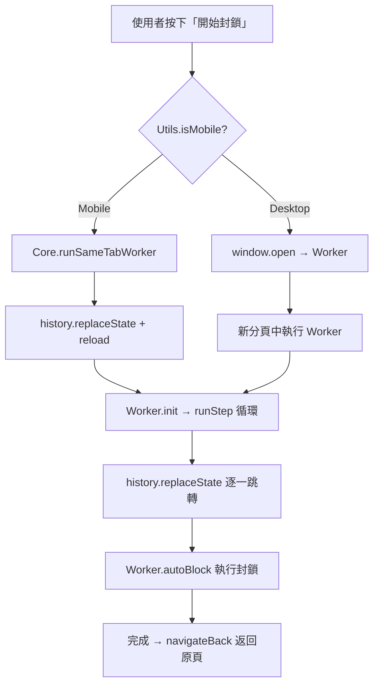

# 🛡️ 封鎖機制架構文件 (Blocking Architecture)

> **⚠️ 重要：任何涉及封鎖流程的修改前，必須先閱讀此文件。**
> 本文件記錄了所有封鎖路徑、平台差異、以及已知的 iOS 安全限制與對應解法。

---

## 平台偵測

```
Utils.isMobile() → true:  iOS / iPadOS (包含偽裝為 MacIntel 的 iPad)
Utils.isMobile() → false: Desktop (Mac/Windows/Linux)
```

偵測邏輯位於 `src/utils.js`，iPad 透過 `navigator.platform === 'MacIntel' && navigator.maxTouchPoints > 1` 判定。

---

## 兩種封鎖路徑總覽



---

## 路徑 1：Mobile 同分頁 Worker (`runSameTabWorker`)

**檔案**：`core.js` → `worker.js`
**適用**：iOS / iPadOS
**入口**：`main.js:handleMainButton` → `Core.runSameTabWorker()`

### 流程

1. 將 `pendingUsers` 合併至 `BG_QUEUE` (localStorage)
2. 儲存 `hege_return_url` = 當前頁面 URL（去除 `hege_bg` 參數）
3. **`history.replaceState`** 修改 URL 為 `/?hege_bg=true`
4. **`location.reload()`** 重新載入頁面
5. 頁面載入後，`main.js` 偵測 `hege_bg=true` → 呼叫 `Worker.init()`
6. Worker 顯示全螢幕進度 UI（進度條、ETA、統計、停止按鈕）
7. `Worker.runStep()` 逐一處理佇列：
   - 以 **`history.replaceState`** + `reload` 跳轉到 `/@username?hege_bg=true`
   - 執行 `Worker.autoBlock()` 自動化封鎖流程
8. 佇列清空後，`Worker.navigateBack()` 以 **`history.replaceState`** + `reload` 返回原頁

### ⛔ iOS 安全限制（絕對不能違反）

| 禁止行為 | 原因 |
|---|---|
| `window.location.href = 'threads.net/...'` | 觸發 **Universal Links**，開啟原生 Threads App |
| `window.open(...)` | 被 Safari **彈出視窗阻擋器**攔截 |
| `<iframe src="threads.net">` | UserScript **不會注入** iframe |
| click handler 內直接 `location.href` | 即使 setTimeout(0) 也可能觸發 Universal Links |

### ✅ 唯一安全的導航方式

```javascript
history.replaceState(null, '', newPath);
location.reload();
```

這不是「導航到新頁面」，而是「修改當前 URL + 重新整理」，Safari 不會觸發 Universal Links。

---

## 路徑 2：Desktop 背景分頁 Worker (`window.open`)

**檔案**：`main.js` → `worker.js`
**適用**：Desktop（Mac / Windows / Linux）

### 流程

1. 將 `pendingUsers` 合併至 `BG_QUEUE`
2. `window.open('https://www.threads.net/?hege_bg=true', ...)` 開啟新分頁
3. 新分頁載入 → `Worker.init()` → `Worker.runStep()` 循環
4. Worker 顯示進度 UI（與 Mobile 相同的進度條、ETA、統計、停止按鈕）
5. Worker 以 `window.location.href` 逐一跳轉（Desktop 不受 Universal Links 影響）
6. 完成後 `window.close()` 關閉分頁

### 跨分頁通訊

- Worker 透過 `localStorage` (BG_STATUS, BG_QUEUE) 與主分頁同步狀態
- 主分頁透過 `window.addEventListener('storage', ...)` + `setInterval` 輪詢更新 UI

---

## 其他觸發封鎖的入口

### 同列全封 (`handleBlockAll`)

**檔案**：`core.js:injectDialogBlockAll`
**行為**：將對話框（如「貼文動態」、「讚」）中的所有使用者加入 `pendingUsers`
**不直接執行封鎖**，使用者需回到面板點擊「開始封鎖」

#### iOS 觸控事件處理

```javascript
// Mobile: touchstart + touchend 搭配 preventDefault
blockAllBtn.addEventListener('touchend', (e) => {
    e.stopPropagation();
    e.preventDefault(); // 防止合成 click 觸發 Universal Links
    handleBlockAll(e);
}, { passive: false });

// Desktop: 原生 click
blockAllBtn.addEventListener('click', handleBlockAll);
```

### 重試失敗清單 (`retryFailedQueue`)

**檔案**：`core.js`
**行為**：將 `FAILED_QUEUE` 中的使用者移回 `BG_QUEUE`，然後：
- Mobile → `Core.runSameTabWorker()`
- Desktop → `window.open(...)`

### 匯入清單 (`importList`)

**檔案**：`core.js`
**行為**：解析使用者輸入的 ID 清單，過濾已封鎖的，加入 `BG_QUEUE`，然後：
- Mobile → `Core.runSameTabWorker()`
- Desktop → `window.open(...)`

---

## UI 面板事件綁定

**檔案**：`ui.js:createPanel`

面板按鈕統一使用**原生 `click` 事件**（不使用 touchend + preventDefault）。

**原因**：面板 `#hege-panel` 直接掛在 `document.body`，不在任何 `<a>` 標籤內部，因此不會觸發 Universal Links。而且保留原生 click 可以確保 Safari 的安全性政策允許後續操作（如 `confirm()`、`prompt()` 等）。

---

## Checkbox 事件綁定

**檔案**：`core.js:scanAndInject`

Checkbox 嵌入在 Threads 的 DOM 樹中（貼文旁邊的 `...` 按鈕附近），底下可能有 `<a href="/@username">` 連結。

```
Mobile:  touchstart(stopPropagation) + touchend(stopPropagation + preventDefault + handleGlobalClick)
Desktop: click(handleGlobalClick, capture: true) + ontouchend(stopPropagation)
```

**`preventDefault` 在這裡是必要的**，因為 iOS Safari 會將 touchend 合成為 click 事件，該 click 可能穿透到底下的 `<a>` 標籤觸發 Universal Links。

---

## 資料儲存 (Storage Keys)

| Key | 類型 | 說明 |
|---|---|---|
| `hege_block_db_v1` | localStorage (JSON) | 已封鎖使用者歷史 |
| `hege_pending_users` | sessionStorage (JSON) | 當前選取的使用者 |
| `hege_active_queue` | localStorage (JSON) | 背景 Worker 的待處理佇列 |
| `hege_bg_status` | localStorage (JSON) | Worker 狀態 (state, current, progress, total, ETA, stats) |
| `hege_bg_command` | localStorage | Worker 控制指令 (如 'stop') |
| `hege_failed_queue` | localStorage (JSON) | 封鎖失敗的使用者 |
| `hege_cooldown_queue` | localStorage (JSON) | 觸發冷卻時備份的待處理佇列（含回滾名單） |
| `hege_rate_limit_until` | localStorage | 12 小時冷卻解除的時間戳記 |
| `hege_block_timestamps` | localStorage (JSON) | 紀錄最近 50 筆封鎖歷史用於智慧回滾 |

---

## Worker 自動封鎖流程 (`autoBlock`)

**檔案**：`worker.js`

```
1. 等待頁面載入 (2.5s)
2. Polling 尋找「更多」SVG 按鈕 (最多 12s)
   └─ 檢查 SVG 結構：circle + path ≥ 3
3. simClick 點擊「更多」按鈕
4. Polling 等待選單出現 (最多 8s)
   ├─ 偵測到「解除封鎖」→ return 'already_blocked'
   └─ 偵測到「封鎖」→ 點擊
5. Polling 等待確認對話框 (最多 5s)
   ├─ 偵測到限制訊息 → return 'cooldown'
   └─ 點擊紅色確認按鈕
6. 等待對話框關閉 (最多 8s)
   └─ return 'success' 或 'failed'
```

### 結果處理

| 結果 | 處理 |
|---|---|
| `success` / `already_blocked` | 進入 **自適應驗證 (Adaptive Verification)**。若驗證成功則移出佇列並寫入 DB。 |
| `failed` | 從 BG_QUEUE 移除，加入 FAILED_QUEUE |
| `cooldown` | 觸發 `triggerCooldown()`，12小時鎖定並備份名單 |

---

## 🛡防護機制：自適應驗證 (Adaptive Verification)

**目的**：對抗 Threads 伺服器的「假性成功」（UI 顯示已封鎖但實際未生效）。

**機制**：
1. **動態抽樣**：根據連續失敗次數調整驗證頻率。
   - Level 0 (預設): 每 5 次封鎖抽樣驗證 1 次。
   - Level 1 (發生過失敗): 每 3 次驗證 1 次。
   - Level 2 (頻繁失敗): 每次都驗證。
2. **驗證方式 (`verifyBlock`)**：重啟該用戶的「更多」選單，若出現「解除封鎖 (Unblock)」代表真成功；若仍是「封鎖 (Block)」，代表遇到靜默限制。
3. 若 Level 2 連續 5 次驗證失敗，將視為遭到嚴格限制，強制進入**冷卻模式**。

---

## ❄️防護機制：12 小時冷卻鎖 (Rate-Limit Protection)

**檔案**：`worker.js:triggerCooldown`

**觸發條件**：
1. `autoBlock` 中偵測到「稍後再試」等官方對話框。
2. 自適應驗證系統連續 5 次偵測到「假性成功」。

**執行流程 (智慧回滾 Auto-Rollback)**：
1. 立即停止當前 Worker 迴圈。
2. 將剩餘排隊名單全數移入 `COOLDOWN_QUEUE` (`hege_cooldown_queue`)。
3. **回滾歷史**：從 `DB_TIMESTAMPS` 中抓出最近 50 筆已當作成功的帳號，自動從 `DB_KEY` 中拔除，並塞回 `COOLDOWN_QUEUE`（防止這些人也是因靜默限制而漏鎖）。
4. 設定 `hege_rate_limit_until` 為當下時間 + 12 小時。
5. 前台 UI (`main.js`) 會因為 Storage Event 即時鎖住所有封鎖按鈕並顯示紅色警告。12 小時清醒後，名單將無損回填。
