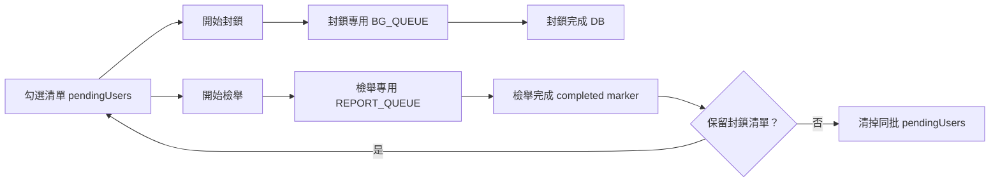
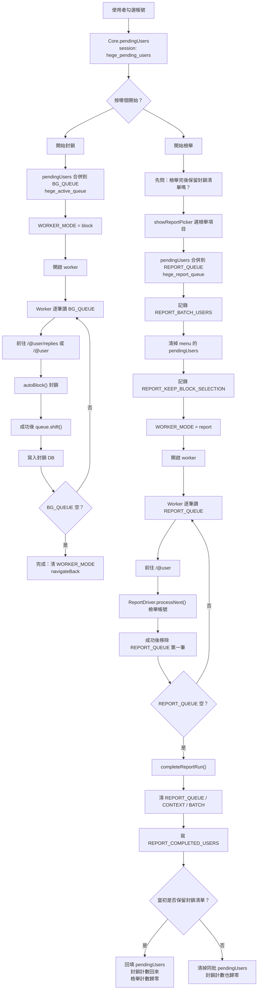
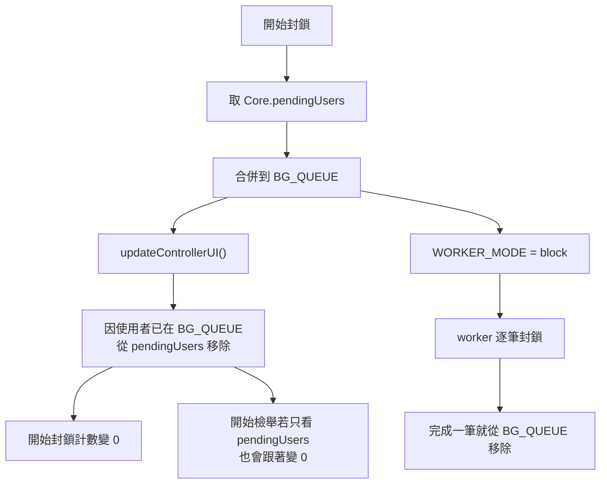
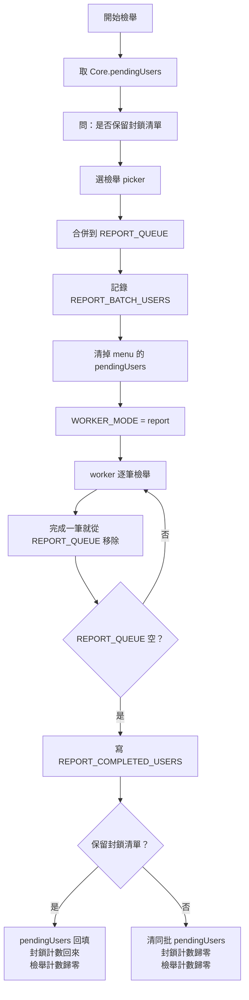

# [Goal Description]
建立「批次檢舉」功能，讓使用者能批次檢舉 Threads 使用者，但不走封鎖路徑。此功能對應產品哲學：「鼓勵集體檢舉而非消極封鎖」。

Phase 1 只實作「只檢舉」mode：使用者選定檢舉類別後，系統將目標使用者加入獨立檢舉佇列，並由 worker 逐筆執行 Threads 檢舉流程。未來 Phase 2 可擴展為「封鎖前先檢舉」mode，在封鎖前先完成檢舉送出。

---

## User Review Required
> [!IMPORTANT]
> 以下 5 個設計決策已敲定，實作時應以 ADR 規格視為固定前提。

### ADR 0001：Phase 1 先做「只檢舉」mode
Phase 1 僅新增「只檢舉」mode，不實作「封鎖前先檢舉」。檢舉流程與封鎖流程保持隔離，避免讓既有封鎖路徑承擔新風險。

### ADR 0002：檢舉類別限定為 5 類
首版只支援以下 5 個 Threads 檢舉類別：
- 霸凌或擾人的聯繫
- 暴力、仇恨或剝削
- 裸露或性行為
- 詐騙、詐欺或垃圾訊息
- 不實資訊

### ADR 0003：檢舉 path 存成 array
檢舉路徑以 array 儲存，例如 `["霸凌或擾人的聯繫", "霸凌或騷擾", "我"]`。這能支援不同深度的 menu tree，也避免以字串切割造成類別名稱相依。

### ADR 0004：觸發入口為 dialog 與 panel 雙入口
觸發入口包含 dialog 的「🚨 只檢舉」按鈕，以及 panel 的「🚨 開始檢舉」按鈕。Dialog 入口用於目前可見名單；panel 入口用於已選取 pendingUsers 或既有 REPORT_QUEUE。

### ADR 0005：使用獨立 REPORT_QUEUE 與 DAILY_REPORT_LIMIT
批次檢舉使用獨立 `REPORT_QUEUE`，不混入封鎖用 `BG_QUEUE`。每日上限使用獨立 `DAILY_REPORT_LIMIT` 與 `REPORT_TIMESTAMPS_RING`，避免檢舉節流與封鎖節流互相污染。

---

## Current beta28 Architecture

> [!NOTE]
> 本章記錄 beta `2.5.4-beta28` 的實作心智模型。舊版 Proposed Changes 仍保留作為原始設計脈絡，但 beta28 已加入 `WORKER_MODE`、`REPORT_BATCH_USERS`、`REPORT_COMPLETED_USERS`、`REPORT_KEEP_BLOCK_SELECTION`、`REPORT_RESTORE_PENDING` 與「檢舉流程可視化」等後續修正。

### 正確心智模型

`pendingUsers` 是封鎖與檢舉共用的「候選池」。使用者按下開始後，才分流成兩套獨立工作佇列：

- 封鎖使用 `BG_QUEUE` / `hege_active_queue`
- 檢舉使用 `REPORT_QUEUE` / `hege_report_queue`

封鎖完成靠 `DB_KEY` 判斷；檢舉完成靠 `REPORT_COMPLETED_USERS` 判斷。兩者不應互相污染。



### 總覽流程



### 開始封鎖流程



### 開始檢舉流程



### 封鎖與檢舉差異表

| 項目 | 開始封鎖 | 開始檢舉 |
|---|---|---|
| 共用入口 | `Core.pendingUsers` | `Core.pendingUsers` |
| 主 queue | `BG_QUEUE` / `hege_active_queue` | `REPORT_QUEUE` / `hege_report_queue` |
| worker mode | `block` | `report` |
| worker 目標頁 | `/@user/replies` 或 `/@user` | `/@user` |
| 執行動作 | `Worker.autoBlock()` | `Core.ReportDriver.processNext()` |
| 完成一筆 | 從 `BG_QUEUE` 移除 | 從 `REPORT_QUEUE` 移除 |
| 完成全部 | 清 `WORKER_MODE`，返回 | 清 report queue/context/batch，寫 completed，返回 |
| 是否清 pendingUsers | 一進 `BG_QUEUE` 後 UI cleanup 會移除 | 依「是否保留封鎖清單」決定 |
| 對另一邊計數影響 | 會讓檢舉計數跟著少，因 pending 被吸走 | beta28 後啟動時先清 menu 計數；若保留封鎖清單，完成或中斷後回填封鎖計數 |

### beta28 符合度評估

beta28 的 panel「開始檢舉」流程大致符合上述心智模型：

- `REPORT_QUEUE` 與 `BG_QUEUE` 已分離。
- `WORKER_MODE = report/block` 已分離 worker 分支。
- `REPORT_BATCH_USERS` 記錄本次檢舉批次。
- `REPORT_KEEP_BLOCK_SELECTION` 記錄檢舉完成後是否保留封鎖清單。
- `REPORT_COMPLETED_USERS` 用於讓檢舉計數歸零，但保留給封鎖用的 pending 仍可存在。
- `REPORT_RESTORE_PENDING` 用於 desktop popup worker 通知主頁回填封鎖勾選。
- `completeReportRun()` 會在 REPORT_QUEUE 清空時清理 report 專用狀態。
- 檢舉啟動時會先把 pending 搬進 report batch 並清掉 menu 上的勾選計數，與「開始封鎖」一致。

仍需注意的實作邊界：

- Dialog「只檢舉」入口仍可能直接呼叫 `ReportDriver.processNext({ ctx })`，不是完整 panel worker 啟動路徑；若要 100% 符合模型，dialog 入口也應寫入 `REPORT_BATCH_USERS` / `REPORT_KEEP_BLOCK_SELECTION`，並走 `WORKER_MODE = report`。
- 封鎖流程仍會把 `pendingUsers` 吸進 `BG_QUEUE`，因此按「開始封鎖」後檢舉候選計數歸零是預期行為，不代表 `REPORT_QUEUE` 被清掉。
- 現行 `REPORT_MENU_TREE`、每日檢舉預設上限與舊 Proposed Changes 有 drift；以 `src/config.js` 的 beta27 實作為準。

---

## Proposed Changes

### [CONFIG]
#### [MODIFY] src/config.js
- 新增 `CONFIG.REPORT_MENU_TREE`，定義 5 個檢舉類別的完整 menu tree，leaf 可包含 `ageQuestion: true` flag。
- 新增 `CONFIG.DAILY_REPORT_LIMIT_DEFAULT = 100`。
- 新增 `CONFIG.DAILY_REPORT_LIMIT_OPTIONS = [50, 100, 150, 200]`。
- 新增 `CONFIG.KEYS.REPORT_QUEUE`：獨立檢舉佇列。
- 新增 `CONFIG.KEYS.REPORT_PATH`：Settings 預設檢舉路徑。
- 新增 `CONFIG.KEYS.REPORT_BATCH_PATH`：本次批次檢舉使用的路徑。
- 新增 `CONFIG.KEYS.DAILY_REPORT_LIMIT`：每日檢舉上限。
- 新增 `CONFIG.KEYS.REPORT_TIMESTAMPS_RING`：rolling 24h 檢舉紀錄。

#### REPORT_MENU_TREE 預期結構
```js
CONFIG.REPORT_MENU_TREE = {
  "霸凌或擾人的聯繫": {
    "霸凌或騷擾": {
      "我": {},
      "其他人": {}
    },
    "不想要的聯繫": {}
  },
  "暴力、仇恨或剝削": {
    "可信的暴力威脅": {},
    "仇恨言論或符號": {},
    "人口販運或剝削": {}
  },
  "裸露或性行為": {
    "成人裸露或性行為": { ageQuestion: true },
    "威脅分享私密影像": {},
    "兒童性剝削": {}
  },
  "詐騙、詐欺或垃圾訊息": {
    "詐騙或詐欺": {},
    "垃圾訊息": {}
  },
  "不實資訊": {
    "健康": {},
    "政治": {},
    "社會議題": {}
  }
};
```

### [STORAGE]
#### [MODIFY] src/storage.js
- 新增 `Storage.recordReport()`：檢舉成功後寫入 timestamp ring。
- 新增 `Storage.getReportsLast24h()`：計算 rolling 24h 內已完成檢舉數。
- 新增 `Storage.isUnderReportLimit()`：比對 `DAILY_REPORT_LIMIT`，判斷 worker 是否可繼續檢舉。
- `REPORT_QUEUE` 沿用既有 `Storage.queueAddUnique()` 與 `Storage.queueRemove()`，避免重複加入同一使用者。

### [CORE]
#### [ADD] src/features/report-flow.js
- 新增 `Core.ReportDriver.processNext()`，負責從 `REPORT_QUEUE` 逐筆執行 Threads 檢舉流程。

#### processNext() 流程
1. 從 `REPORT_QUEUE` shift 出下一位使用者。
2. 檢查 `Storage.isUnderReportLimit()`；若已達上限，worker 進入 1 小時 cooldown。
3. 在目前頁面找對應 user row。
4. 點擊 user row 的 `...` menu。
5. 點擊「檢舉」。
6. 依 `REPORT_BATCH_PATH` 或 `REPORT_PATH` traverse `CONFIG.REPORT_MENU_TREE`。
7. 若 leaf 帶有 `ageQuestion: true`，自動點擊「否」。
8. 確認並送出檢舉。
9. 呼叫 `Storage.recordReport()`。
10. 使用 `setTimeout()` 延遲啟動下一筆，降低 Threads rate limit 風險。

### [UI]
#### [MODIFY] src/core.js / src/ui.js
- 在 likes dialog、Activity dialog、Likes tab 注入「🚨 只檢舉」按鈕；其他位置不顯示。
- Dialog 按鈕 click 後呼叫 `UI.showReportPicker(callback)`。
- Picker 使用 cascading dropdown 顯示 `CONFIG.REPORT_MENU_TREE`，使用者確認後，將可見名單推入 `REPORT_QUEUE`，並設定 `REPORT_BATCH_PATH`。

#### [MODIFY] src/ui.js
- Panel 新增「🚨 開始檢舉」按鈕，永遠顯示。
- Panel button badge 顯示 `REPORT_QUEUE` 目前筆數。
- Panel 按鈕 click 時：
  1. 若 `pendingUsers` 有資料，跳出 picker，確認後推進 `REPORT_QUEUE`，但不清空 `pendingUsers`。
  2. 若 `pendingUsers` 為空但 `REPORT_QUEUE` 有資料，直接啟動 worker。
  3. 若兩者皆空，顯示無待檢舉目標狀態。
- Settings 新增「檢舉預設路徑」cascading picker，存入 `REPORT_PATH`；picker modal 開啟時以該 path pre-select。
- Settings 新增「每日檢舉上限」下拉選單，選項使用 `DAILY_REPORT_LIMIT_OPTIONS`。

### [Worker]
#### [MODIFY] src/worker.js
- 在 `worker.runStep()` 內，當 `BG_QUEUE` 為空時檢查 `REPORT_QUEUE`。
- 若 `REPORT_QUEUE` 非空，呼叫 `Core.ReportDriver.processNext()`。
- 當 `REPORT_QUEUE` 清空時，自動 clear `REPORT_BATCH_PATH`，避免下一批誤用上一批路徑。

---

## Verification Plan
1. 測試 5 個類別各選一個 leaf，確認 worker 能走完流程。
2. 測試 `ageQuestion: true` 的 leaf，確認自動點「否」。
3. 測試 picker 的 pre-select：之前選過的 path 下次開 picker 要預填。
4. 測試 panel 按鈕：pending 有 user 時跳 picker；pending 空但 `REPORT_QUEUE` 有東西時直接 start worker。
5. 測試跨 tab：Tab A 跑 worker 時，Tab B tick 不會搶 worker。
6. 測試 daily limit：達 100 時 worker 進 cooldown 1h。
7. 測試 queue 清空：自動清 `REPORT_BATCH_PATH`。

---

## Risks
- Threads 檢舉 DOM 結構可能變化，且沒有官方 API 可依賴。
- 檢舉 rate limit 未知，100/day 是保守估計，仍可能需要依實測調整。
- Picker 若選錯類別，可能導致批次檢舉誤報，因此確認按鈕文案與 pre-select 狀態必須清楚。
- 跨 tab 使用共享 localStorage 的 `REPORT_QUEUE`，多 tab 可能同時跑 worker；首版沿用 `BG_STATUS.workerActive` 防止爭搶。
- 檢舉流程 path 深度不一：垃圾訊息 1 層、威脅分享裸照 2 層、霸凌 3 層，polling 時序需要容錯。
- 目前 beta5 已出現 syntax error (`onClearSel` const declaration 缺初始化)，下次實作需先修 base。

---

## Future work
Phase 2 將評估新增「封鎖前先檢舉」mode：在封鎖流程開始前先依設定 path 完成檢舉，再接續既有封鎖佇列與每日封鎖上限策略。
